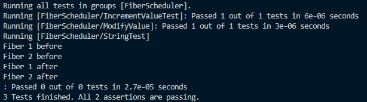

# ASP: Group Assignment - Fiber Scheduler
### (Student IDs : 21047697 & 22002656)

---

## Table of contents:
* [Task 1](#task-1)
  * test
* [Task 2](#task-2)
  * test
* [Task 3](#task-3)
   * test
  

##  Project Overview

This project aims to implement a fiber scheduler using cooperative multitasking with custom context management. Fibers, lightweight cooperative threads, are scheduled and executed in a non-preemptive manner. This README provides an overview of the code structure and highlights key features in the implementation that contributes to the functionality of the program.

# Task 1

## Overview
Task 1 asks to simply implement a program that executes two sample functions `foo` and `goo`, using the `Context` library

## Main Implementation

### Data Structures

- **Context Objects**: Two `Context` objects, `c` and `c_main`, are declared for managing task states.
- **Task Counter**: An integer `tasks_done` is used to count the number of completed tasks.

### Functions

1. **`foo()`**
   ```cpp
   void foo() {

    std::cout << "you called foo" << std::endl;
    tasks_done++;

    swap_context(&c, &c_main); 

   }
   
   ```
   - This function is a sample task that performs the following:
   - Prints a message.
   - Increments the task counter (`tasks_done`).
   - Swaps the context back to `c_main` using `swap_context`.

2. **`goo()`**
   ``` cpp
   void goo(){

    
    std::cout<<"you called goo"<<std::endl;
    tasks_done++;

    swap_context(&c,&c_main); 

   }

   ```
   - Another sample function similar to `foo()`.

3. **`main()` Function**:
   - **Stack Setup**: Allocates and initializes the stack for fibers, adjusting the stack pointer for alignment.
   - **Fiber Scheduling Loop**: Enters a loop to alternate between calling `foo` and `goo` based on the parity of `tasks_done`.
   - **Context Setting**: Sets the context for each function by configuring the instruction pointer (`rip`) and stack pointer (`rsp`).
   - **Context Swapping**: Swaps contexts using custom context management functions until `tasks_done` reaches 2.

### Building and Running

- Ensure that the appropriate build tools and dependencies are available for your platform.

- To build and run, type this in the command line:

  ```bash
  clang++ main.cpp context.o -o program; ./program
  ```

### Output and Observations

The output for Task 1:


### Notes:
- Executiom of any cpp file would fail when ran locally on a machine that has clang installed. It requires being built and ran on the csctcloud via SSH to execute successfully and without errors.


# Task 2

## Overview

 Task-2 introduces a scheduler class (`scheduler`) and two example fiber functions (`func1` and `func2`) that demonstrate the functionality of the cooperative multitasking system. Implementing the scheduler class allowed fibers to be added to queue, spawning them before executing anything, then  running one fiber at a time. A fiber executes after the previous fiber has been executed completely, which is simply the "First In First Out" (FIFO) model, the `<deque>` library is suitable for storing the fibers. 

## Scheduler Class

The `scheduler` class manages the execution of fibers using a deque data structure for fiber storage. Key features of the `scheduler` class include:

- **Constructor**: The class constructor initializes the scheduler with optional initial data and creates a deque for storing fibers.

- **`spawn` Method**: This method allows the scheduler to spawn a new fiber by adding it to the deque.

- **`do_it` Method**: The `do_it` method performs the fiber scheduling. It retrieves the context of the current execution, checks if there are fibers in the deque, and if so, selects the first fiber for execution. The context is then set to that of the selected fiber, and after execution, the original context is restored.
   ```cpp
   void do_it() {
        get_context(&context_);

        if (!fibers_.empty()){
            this_fiber = fibers_.front();
            fibers_.pop_front();
            set_context(this_fiber->get_context());
        }
        set_context(&context_);
        this_fiber = nullptr;  }
   ```

- **`get_data` Method**: A getter method to retrieve the data associated with the current fiber.

- **`fiber_exit` Method**: Signals the exit of the current fiber by setting the context back to the original execution context.

## `fiber` Class

The `fiber` class represents a fiber, which includes a function pointer and associated data. Key features of the `fiber` class include:

- **Constructor**: Allocates a new stack for the fiber, adjusts the stack top for function execution, and initializes the context with the provided function pointer and adjusted stack top.

- **Destructor**: Cleans up the allocated stack memory.

- **`get_context` Method**: A getter method to retrieve the context of the fiber.

- **`get_data` Method**: A getter method to retrieve the data associated with the fiber.

## `fiber_api` Module

The `fiber_api` module provides API functions that interact with the scheduler:

- **`fiber_exit` Function**: Signals the exit of the current fiber, invoking the scheduler's `fiber_exit` method.

- **`get_data` Function**: Retrieves the data associated with the current fiber using the scheduler's `get_data` method.

- **`spawn` Function**: Spawns a new fiber by invoking the scheduler's `spawn` method.

- **`do_it` Function**: Performs fiber scheduling by invoking the scheduler's `do_it` method.

## Example Usage (`main.cpp`)

The `main.cpp` file showcases the usage of the fiber scheduler and the example fiber functions:

- Creates two fiber instances (`f1` and `f2`) with associated functions and data.

- Spawns the first fiber (`f1`) and then the second fiber (`f2`).

- Invokes the `do_it` function to perform fiber scheduling.

- The fiber functions (`func1` and `func2`) demonstrate interaction with the scheduler using API functions (`get_data` and `fiber_exit`).

   ```cpp
   fiber *f2 = new fiber(&func2, &d);
   fiber *f1 = new fiber(&func1, &d);

   spawn(f1, &d);
   spawn(f2, &d);

   do_it();
   ```

### Building and Running
---
- Ensure that the appropriate build tools and dependencies are available for your platform.

- To build and run, type this in the command line:

   ```bash
   clang++ 
   ```

### Output and Observations

The output for Task 2:


- "entered main": Indicates the start of the main function

- "after spawn func1": Printed after spawning 'f1'

- "after spawn func2": Printed after spawning 'f2'

- "fiber 1 started": Indicates the start of the execution of 'func1'

- "fiber 1, 10": Indicates the value of d when accessed from 'func1'

- "fiber 2 started": Indicates the start of the execution of 'func2'

- "fiber 2, 10": Indicates the value of d when accessed from 'func2'


### Notes:
---
- Executiom of any cpp file would fail when ran locally on a machine that has clang installed. It requires being built and ran on the csctcloud via SSH to execute successfully and without errors.


# Task 3

## Overview

 Task 3 revolves around extending the scheduler with a `yield()` function and demonstrate its usage with get_data.


## `yield` function

The `yield` function yields control from the fiber at hand to the scheduler.


`yield` In the `scheduler.hpp` file:

```cpp

void yield(){
   if(!fibers_.empty()){
      auto current_contextt = this_fiber_ -> get_context();
      fibers_.push_back(this_fiber_);
      this_fiber_ = fibers_.front();
      fibers_.pop_front();

      swap_context(current_context, this_fiber_ -> get_context());
   }
}
```

The function does the following:

- Begins by checking if deque is not empty

- Then gets the context of current fiber 

- Later adds the current fiber to the end of deque 

- Sets the current fiber to the next one
and removes the current fiber using `fiber_.pop_front();`

- Finally it swaps the context of both current fiber and the scheduler using `swap_context` from `context.hpp`


## Example Usage (`main.cpp`)

The `main.cpp` file showcases the usage of the `yield()` function in the fiber scheduler:


### Building and Running
---
- Ensure that the appropriate build tools and dependencies are available for your platform.

- To build and run, type this in the command line:

```bash
clang++ 
```

### Output and Observations

The output for Task 3 without any tests:



- 

### Notes:
---
- Executiom of any cpp file would fail when ran locally on a machine that has clang installed. It requires being built and ran on the csctcloud via SSH to execute successfully and without errors.
